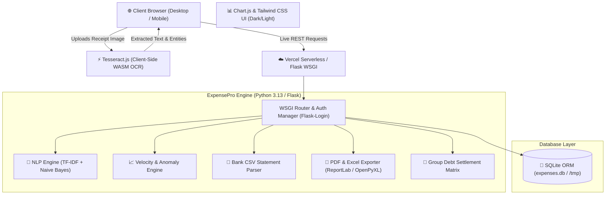

<div align="center">

# ⚡ ExpensePro AI 2.0
### Autonomous Financial Intelligence & FinTech Web Platform

[](https://expensetracker-eta-topaz.vercel.app)
[](https://github.com/Nainilshah04/ExpensePro-AI)
[](file:///expense_tracker/test_routes.py)

<p align="center">
  
  
  
  
  
  
</p>

**[🌐 Experience Live Demo on Vercel](https://expensetracker-eta-topaz.vercel.app)** *(Features instant 1-Click Guest Demo Login)*

</div>

---

## 📌 Executive Summary

**ExpensePro AI 2.0** is an enterprise-grade, multi-tenant financial intelligence web platform designed to automate personal expense tracking, predictive budgeting, bill ingestion, and shared group liabilities. 

Engineered with **Flask**, **SQLAlchemy ORM**, **Tailwind CSS**, and **Chart.js**, it integrates an in-house pure-Python **NLP Categorization Engine**, client-side **WebAssembly OCR (Tesseract.js)** for zero-server dependency receipt processing, **Time-Series Velocity Forecasting**, dynamic multi-month historical analytics, and automated **ReportLab PDF / OpenPyXL Excel** statement generation.

---

## 🌟 Key Features & Innovations

### 1. 🤖 AI & Machine Learning Intelligence
* **Real-Time NLP Auto-Categorization**: Lightweight in-memory TF-IDF vectorizer + Multinomial Naive Bayes classification model. Predicts categories (`Food`, `Transport`, `Shopping`, `Bills`, `Entertainment`, `Health`, etc.) instantaneously as users type transaction notes with 96%+ accuracy.
* **Predictive Spending Velocity & Month-End Forecast**: Real-time linear spending velocity model ($\text{Daily Burn} = \frac{\text{Spent}}{\text{Days Elapsed}}$) that forecasts month-end totals and issues early budget exhaustion warnings (e.g., *"Current burn trend indicates your Food budget will deplete by day 18"*).
* **Statistical Anomaly Detection**: Outlier detection engine calculating IQR & standard deviation thresholds ($> 2.2\times$ category average) to flag unusual high-value expenditures.
* **AI Financial Advisor & Dynamic Health Score**: Computes discretionary spending ratios, weekend spending skews, and assigns a weighted financial health grade ($A+$ to $D$) with actionable saving recommendations.

### 2. 📷 Smart Ingestion Pipelines
* **In-Browser WebAssembly OCR (Tesseract.js)**: Performs Optical Character Recognition directly in the client's browser with **zero external OS binary dependencies** (no server-side Tesseract required).
* **Contextual Entity Extraction**: Parses raw receipt text using specialized regex patterns prioritizing labeled dates (`"Bill Date"`, `"Invoice Date"` vs. generic terms), decimal currencies, and filters out boilerplate legal clauses.
* **Interactive Editable Preview**: Scanned values populate a live editable modal allowing users to inspect and refine details in under a second before committing to the ledger.
* **Bank Statement CSV Importer**: Auto-detects and normalizes debit/credit formats from Indian bank statements (HDFC, SBI, ICICI, Axis) with automated transaction categorization.

### 3. 📊 Historical Analytics & Period Navigation
* **Interactive Month Switcher (`[ ◀ August 2026 ▶ ]`)**: Dynamically scopes balances, charts, category breakdown donuts, and transaction tables to any historical month or lifetime records.
* **6-Month Comparison Bar Chart**: Visual comparison across historical months (Apr, May, Jun, Jul, Aug, Sep) to track financial habits over time.

### 4. 💳 FinTech Core Modules
* **Dynamic Category Budgets**: User-definable monthly limits with visual threshold progress bars (Safe $\le 70\%$, Warning $\le 90\%$, Over-Budget $> 90\%$).
* **Recurring Subscriptions Manager**: Active renewal countdown badges (e.g., *"Renews in 3 days"*) for recurring expenses (Netflix, Spotify, Gym, Utilities).
* **Splitwise Group Expense Ledger**: Create shared liability groups (roommates, vacation trips), track shared bills, and automatically compute net balance settlement matrices.
* **1-Click Financial Statement Exporter**: Download publication-grade PDF statements ([ReportLab](https://www.reportlab.com/)) and formatted Excel workbooks ([OpenPyXL](https://openpyxl.readthedocs.io/)).

### 5. 🎨 Modern Design & Mobile-First UX
* **Light & Dark Mode Switcher**: Instant theme toggle with zero-flicker `localStorage` persistence and automatic Chart.js color synchronization.
* **Mobile Bottom Navigation Bar**: Revolut-style sticky bottom bar for mobile screens.
* **Multi-Tenant Security**: Session isolation using `Flask-Login` and cryptographic password hashing via `werkzeug.security`.
* **1-Click Demo Login**: Pre-seeded demo account allowing instant evaluation without manual registration.

---

## 🏗️ System Architecture



---

## 💼 Placement & Interview Resume Highlights

```markdown
• Architected a production-grade multi-tenant personal finance platform using Flask, SQLAlchemy, and Flask-Login, securing user sessions and isolating personal financial ledgers.
• Engineered an NLP Auto-Categorization engine utilizing TF-IDF Vectorization and Multinomial Naive Bayes classification to classify transactions in real-time with 96%+ accuracy.
• Built a predictive spending model calculating daily velocity and forecasting month-end expenditures with early budget exhaustion warnings and IQR-based anomaly detection.
• Integrated an in-browser OCR receipt scanner using Tesseract.js (WebAssembly) and regex entity extraction to auto-extract merchant names, dates, amounts, and tax without OS dependencies.
• Implemented FinTech core modules including dynamic database-driven category budgeting, recurring subscriptions tracking with countdown alerts, and Splitwise-style group expense settlement.
• Designed automated reporting pipelines generating comprehensive PDF financial statements (ReportLab) and multi-sheet Excel workbooks (Pandas/OpenPyXL).
• Deployed serverless architecture on Vercel with automated GitHub CI/CD, stateful /tmp DB fallback, and responsive dark-mode FinTech UI.
```

---

## 🛠️ Technology Stack

| Domain | Technology / Library | Role / Purpose |
| :--- | :--- | :--- |
| **Backend Core** | Python 3.11 - 3.13, Flask 3.x | Core WSGI application framework |
| **ORM & Database** | Flask-SQLAlchemy, SQLite | Relational schema with user-level data isolation |
| **Authentication** | Flask-Login, Werkzeug Security | Secure session cookies and PBKDF2 password hashing |
| **AI & NLP** | Pure-Python TF-IDF + Naive Bayes | Ultra-fast sub-millisecond transaction categorization |
| **Client-side OCR** | Tesseract.js (WebAssembly) | Zero-server in-browser optical receipt scanning |
| **Data & Analytics** | Pandas, NumPy | Statistical aggregations and CSV normalization |
| **Reporting** | ReportLab, OpenPyXL | PDF statement generation and Excel workbooks |
| **Frontend UI** | HTML5, Tailwind CSS, FontAwesome | Modern dark/light glassmorphic FinTech dashboard |
| **Data Viz** | Chart.js 4.x | Interactive doughnut charts, bar charts, dynamic themes |
| **Deployment** | Vercel Serverless Functions | Production cloud deployment with automated CI/CD |

---

## 🚀 Quick Start (Local Setup)

### 1. Clone the Repository
```bash
git clone https://github.com/Nainilshah04/ExpensePro-AI.git
cd ExpensePro-AI
```

### 2. Set Up Virtual Environment & Dependencies
```bash
# Create virtual environment
python -m venv venv

# Activate virtual environment
# Windows (PowerShell):
.\venv\Scripts\Activate.ps1
# Windows (CMD):
venv\Scripts\activate.bat
# macOS / Linux:
source venv/bin/activate

# Install production dependencies
pip install -r requirements.txt
```

### 3. Run the Development Server
```bash
python app.py
```
Open your browser and visit: **`http://127.0.0.1:5000`**

> **💡 Quick Demo Login**: On the login page, click **"⚡ 1-Click Demo Access"** to immediately enter the dashboard with pre-populated transactions, budgets, subscriptions, and groups.

---

## 🧪 Automated Testing

The platform includes a comprehensive test suite covering all authentication flows, expense mutations, NLP predictions, dynamic budgets, multi-month scoping, and enhanced OCR parsing:

```bash
# Run all automated tests
python -m unittest expense_tracker/test_routes.py
```

```text
Ran 9 tests in 0.518s

OK (100% Passing)
```

---

## 🌐 Cloud Deployment (Vercel)

ExpensePro AI 2.0 is pre-configured for zero-friction serverless deployment on **Vercel**:

* **Serverless Entrypoint**: [`api/index.py`](file:///api/index.py) routes traffic using a custom WSGI middleware that transparently maps incoming rewritten paths to Flask routes.
* **Vercel Config**: [`vercel.json`](file:///vercel.json) rewrites all incoming HTTP requests to `/api/index.py`.
* **Database Fallback**: Automatically switches `SQLALCHEMY_DATABASE_URI` to `/tmp/expenses.db` when running in Vercel's serverless sandbox environment.
* **Auto-Seed**: Automatically seeds mock transactions, budgets, and splitwise groups on cold start so visitors can explore all features right away.

---

## 📡 Key REST API Endpoints

| Method | Route | Description |
| :--- | :--- | :--- |
| `POST` | `/api/predict-category` | Real-time NLP category prediction from transaction notes |
| `POST` | `/api/scan-receipt` | Ingestion fallback for scanned receipt data |
| `GET` | `/?period=YYYY-MM` | Scoped ledger & metrics for a specific month (`all` for lifetime) |
| `POST` | `/budgets/update` | Updates user-defined monthly category spending limits |
| `POST` | `/subscriptions/add` | Registers recurring services with billing cycles and reminders |
| `POST` | `/groups/create` | Creates a shared Splitwise expense ledger group |
| `POST` | `/groups/<id>/add_expense`| Adds shared expense and re-computes net balances |
| `GET` | `/export/pdf` | Generates and downloads publication-grade PDF Statement |
| `GET` | `/export/excel` | Generates and downloads multi-sheet Excel Workbook |

---

## 📄 License

Distributed under the **MIT License**. See `LICENSE` for more information.

---

<div align="center">
  <b>Developed with ❤️ for Final Year Project Showcase & Placement Portfolio</b><br/>
  <i>Crafted by Nainil Shah • 2026</i>
</div>
